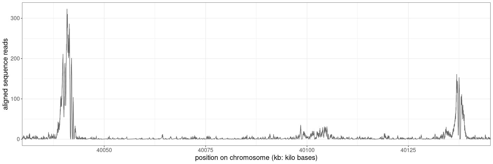
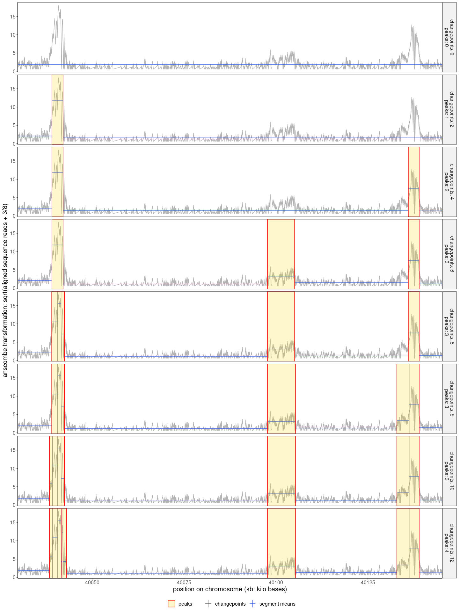

<!-- README.md is generated from README.Rmd. Please edit that file -->

# CROCS (Changepoints for a Range of ComplexitieS)

CROCS is an extension of the CROPS [(Haynes et
al. 2017)](https://www.tandfonline.com/doi/abs/10.1080/10618600.2015.1116445)
and sequential search [(Hocking et
al. 2018)](https://arxiv.org/abs/1810.00117) algorithm which allows to
compute all optimal changepoint segmentations of data sequences for all
penalty values accross a peak range. This package implements the CROCS
algorithm as well as segmentation models for peak calling. They have
been described in our study [Liehrmann et
al. 2020](https://arxiv.org/abs/2012.06848) in a genomic context. On
top of the gfpop method [(Runge et
al. 2020)](https://arxiv.org/abs/2002.03646), it proposes a framework
to design your peak caller. The user can choose among several noise
assumptions `CROCS::lossFactory`, transformations
`CROCS::transformationFactory`, peak shape assumptions
`CROCS::graphFactory` and peak start/end post-processing rules
`CROCS::postProcessingRuleFactory` to build a peak caller
`CROCS::peakCallerFactory`. The `CROCS::CROCS` output is the first step
to compute an objective function that can be optimized in the supervised
learning procedure. We give two examples of its use in the package’s
[Vignette](vignettes/CROCS-vignette.html).

<!-- badges: start -->

<!-- badges: end -->

## Installation

We install the package from Github.

``` r
#devtools::install_github("aLiehrmann/CROCS")
```

## Quick Start

``` r
library(CROCS)
library(data.table)
#> data.table 1.13.6 using 12 threads (see ?getDTthreads).  Latest news: r-datatable.com
library(purrr)
#> 
#> Attaching package: 'purrr'
#> The following object is masked from 'package:data.table':
#> 
#>     transpose
library(ggplot2)
```

We prepare the data. Here we use a coverage profile from a ChIP-Seq
experiment directed to H3K4me3 histone marks.

``` r
counts <- as.data.table(CROCS::counts)
counts <- counts[sample.id == "McGill0036" & chunk==3,]
weights <- counts$chromEnd - counts$chromStart
coverage <- counts$coverage
```

The histone marks of interest appear as regions with high read density
referred to as peaks in the coverage profile.

``` r
ggplot(data = counts, aes(y=coverage, x=chromStart/10^3))+
  geom_line(color="grey40")+
  theme_bw()+
  xlab('position on chromosome (kb: kilo bases)')+
  ylab("aligned sequence reads")+
  theme(
    strip.background = element_rect(fill="grey95"), 
    text = element_text(size=15),
  )+
  coord_cartesian(xlim=c(40035,40140))
```



We define the peak caller. Here we take as example the unconstrained
segmentation model (`"std"`) with gaussian transformed noise (`"mean"`),
based on anscombe transformation (`"anscombe_poisson"`), and the largest
peak post-processing rule as peak caller (`"largest_peak"`).

``` r
std_g <- graphFactory(graph="std")
loss <- lossFactory(type="mean")
tr <- transformationFactory(transformation="anscombe_poisson")
rule <- postProcessingRuleFactory(rule="largest_peak")

my_peak_caller <- peakCallerFactory(
  mygraph=std_g, 
  transformation_f=tr, 
  loss_f=loss,
  postProcessingRule_f=rule
) 
```

We compute all optimal models between 1 and 3 peaks with the help of
`CROCS::CROCS`. In the case we use the negative binomial noise model,
CROCS as a `phi` parameter which must be previded by the user. The
dispersion `phi` parameter links the variance and the mean of the data.

``` r
fit <- CROCS(
  data = coverage, 
  weights = weights, 
  lower_bound_peak = 1, 
  upper_bound_peak = 3, 
  solver = my_peak_caller
)
```

We can visualize all output optimal segmentations on the profile.

``` r
data <- data.table(x=counts$chromStart/10^3, y=tr(coverage))
plotOptModels(
  CROCS_results_p = fit,
  data_p = data,
  xlab_p = "position on chromosome (kb: kilo bases)",
  ylab_p = "anscombe transformation: sqrt(aligned sequence reads + 3/8)",
  xmin_p = 40035,
  xmax_p = 40140
)
#> Warning in as.data.table.list(x, keep.rownames = keep.rownames, check.names =
#> check.names, : Item 1 has 0 rows but longest item has 1; filled with NA
```


